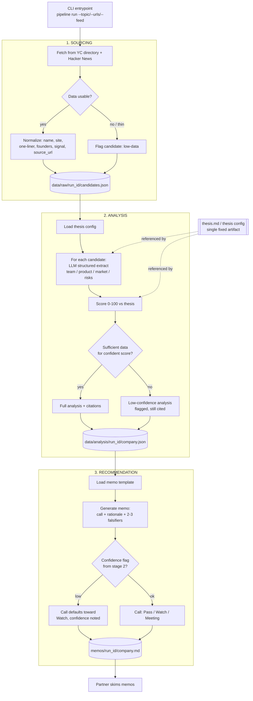

# System Design

A single CLI running 3 file-handoff stages, per [VISION.md](VISION.md).



## Folder Structure

Sourcing, analysis, and recommendation are laid out as **three independent systems**,
each a standalone package with its own entrypoint and its own tests. An orchestrator
runs all three in sequence on one machine today; because each one depends only on the
file contract the previous one wrote, any of them can later be pulled out and run as
its own service using that same contract.

```
.
├── docs/
│   ├── VISION.md
│   └── SYSTEM_DESIGN.md
├── thesis.md                    # single fixed thesis artifact, read by analysis
│
├── sourcing/                    # SYSTEM 1 — independent package
│   ├── __init__.py
│   ├── main.py                  # sourcing run --topic "..." -> writes candidates.json
│   ├── fetch.py                 # YC directory + Hacker News clients
│   ├── normalize.py             # -> candidate schema
│   └── tests/
│
├── analysis/                    # SYSTEM 2 — independent package
│   ├── __init__.py
│   ├── main.py                  # analysis run --input candidates.json -> writes analysis/*.json
│   ├── prompts.py                # structured-extract + scoring, reads thesis.md
│   ├── score.py
│   └── tests/
│
├── recommendation/               # SYSTEM 3 — independent package
│   ├── __init__.py
│   ├── main.py                  # recommendation run --input analysis/*.json -> writes memos/*.md
│   ├── template.py
│   ├── generate.py
│   └── tests/
│
├── orchestrator/
│   └── run.py                   # single command: chains sourcing -> analysis -> recommendation
│
├── common/                      # shared low-level utilities, no business logic
│   ├── retry.py                 # retry/backoff wrapper for external calls
│   └── logging.py                # structured per-run logger
│
├── schemas/                     # versioned JSON schemas for the data/ contract
│   ├── candidate.v1.json
│   └── analysis.v1.json
│
├── data/
│   ├── raw/<run_id>/candidates.json          # sourcing's output = analysis's input
│   └── analysis/<run_id>/<company>.json      # analysis's output = recommendation's input
├── memos/
│   └── <run_id>/<company>.md    # committed, human-readable output
│
├── logs/
│   └── <run_id>.log             # one structured line per candidate per stage
│
├── pyproject.toml / requirements.txt
└── README.md                    # how to run, how to read outputs
```

- Each system takes input and produces output only through the files in `data/` /
  `memos/` — that file contract *is* the interface between systems, so it has to stay
  stable even if what's on either side of it changes later.
- `orchestrator/run.py` is the only thing that knows about all three systems; each
  system communicates with the others only through the files in `data/` / `memos/`.
- `thesis.md` sits at the repo root, outside any one system, since it's read by
  analysis but conceptually owned by the product, not the code.
- `data/` and `memos/` are committed per run so outputs are reviewable without
  re-running anything.

## Notes
- **Stage boundaries = file boundaries.** Each system reads the previous system's
  committed JSON/MD and writes its own — this is what makes independent re-runs, and
  eventually independent scaling, possible without touching the other two.
- **Thesis is one artifact**, read (not re-derived) by the analysis system for every
  candidate — keeps scoring consistent across a run.
- **Low-data path is explicit in every system** (sourcing → analysis → recommendation)
  — a thin candidate degrades to a flagged, lower-confidence output instead of
  crashing the run.
- **Raw fetch output is cached to disk by `run_id`** — sourcing is the only
  network-dependent step, so caching it makes analysis and recommendation replayable
  offline.

## Reliability

- **Every external call (YC directory, Hacker News, LLM) goes through `common/retry.py`**
  — a shared retry-with-backoff wrapper, capped at a small fixed number of attempts.
  Exhausting retries flags that candidate low-data/low-confidence at the current
  stage rather than failing the run.
- **LLM output is validated against `schemas/analysis.v1.json` right after generation.**
  A response that fails validation gets one retry with the validation error appended
  to the prompt; a second failure flags that candidate low-confidence and moves on.
- **A run is a sequence of per-candidate steps, not one atomic unit** — one candidate
  failing sourcing, analysis, or scoring never stops the rest of the run.

## Maintainability

- **The `data/` contract is schema-versioned.** Every JSON file sourcing and analysis
  write includes a `schema_version` field and validates against the matching file in
  `schemas/`. A downstream system can detect a version mismatch instead of failing on
  an unexpected shape.
- **One structured log line per candidate per stage**, written to `logs/<run_id>.log`
  via `common/logging.py` — enough to trace exactly what happened to one candidate
  across all three systems without re-running anything.
- **`common/` holds only generic, business-logic-free utilities** (retry, logging) —
  shared code that changes for infrastructure reasons stays separate from code that
  changes for product reasons.